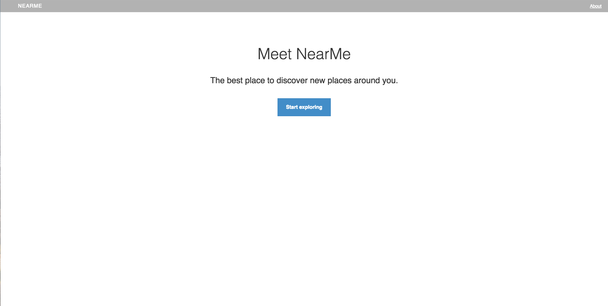
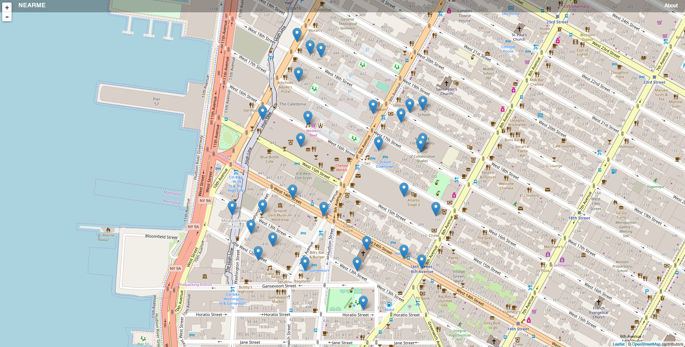

# [Near Me App From codeacademy]('https://www.codecademy.com/courses/learn-angularjs/projects/angularjs_nearme-1')

> https://www.codecademy.com/courses/learn-angularjs/projects/angularjs_nearme-1

### Summary

The idea was to use external directives written and shared by other devs.
This app uses such a directive called leaflet which can be found here:

> http://tombatossals.github.io/angular-leaflet-directive/#!/

> https://leafletjs.com/

## How to run :

1.  clone the repo
2.  `npm i`
3.  `webpack-dev-server --inline`

4.  DevServer is spun and you should then navigate to your localhost.

### Technologies Used

- Angular 1.5x
