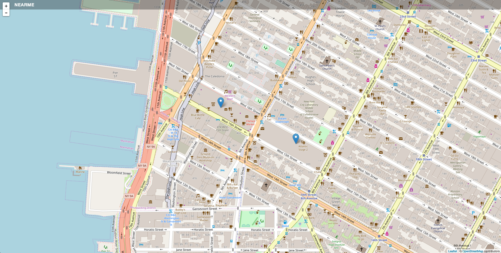

# [Near Me App From codeacademy]('https://www.codecademy.com/courses/learn-angularjs/projects/angularjs_nearme-1')

## How to run :

1.  clone the repo
2.  `npm i`
3.  `webpack-dev-server --inline`

4.  DevServer is span and you should navigate to your localhost.

### Technologies Used

- Angular 1.5x
